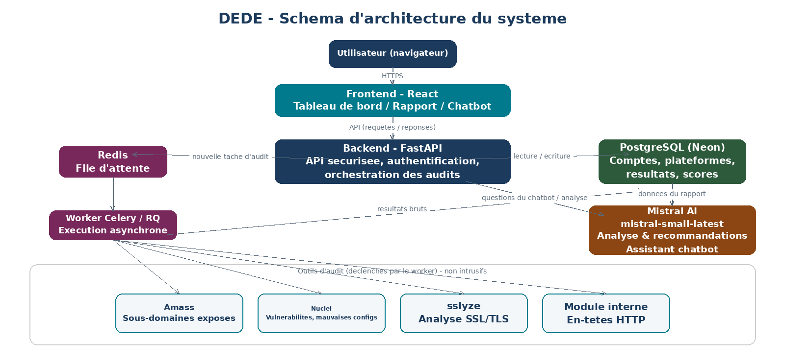

# Architecture DEDE

ƉEƉE est une plateforme SaaS d'audit cybersécurité assisté par IA (MVP hackathon).

## Schéma

## Flux principal

1. L'utilisateur passe par le frontend React (tableau de bord, rapport, chatbot).
2. Le backend FastAPI gère l'authentification JWT, les plateformes et le lancement d'audits.
3. Chaque audit est mis en file d'attente Redis (RQ).
4. Un worker exécute le pipeline fixe des scanners :
   - Amass (sous-domaines, mode passif)
   - Nuclei (vulnérabilités / mauvaises configurations)
   - sslyze (SSL/TLS)
   - module interne (en-têtes HTTP)
5. Les résultats bruts sont stockés dans PostgreSQL (Neon).
6. Mistral AI (`mistral-small-latest`) produit explications et recommandations.
7. Le chatbot interroge le rapport via function calling (mode agentic léger).

## Séparation des responsabilités

| Zone | Rôle |
|------|------|
| `frontend/` | Interface utilisateur |
| `backend/` | API, auth, orchestration, file d'attente |
| `scanners/` | Outils d'audit et scoring |
| `ai/` | Analyse LLM et chatbot |

## Points importants

- Les scanners détectent ; le LLM explique.
- Le pipeline d'audit n'est pas agentic (ordre fixe).
- Le chatbot est agentic léger (function calling sur le rapport uniquement).
- Aucune exploitation active de faille n'est réalisée.
